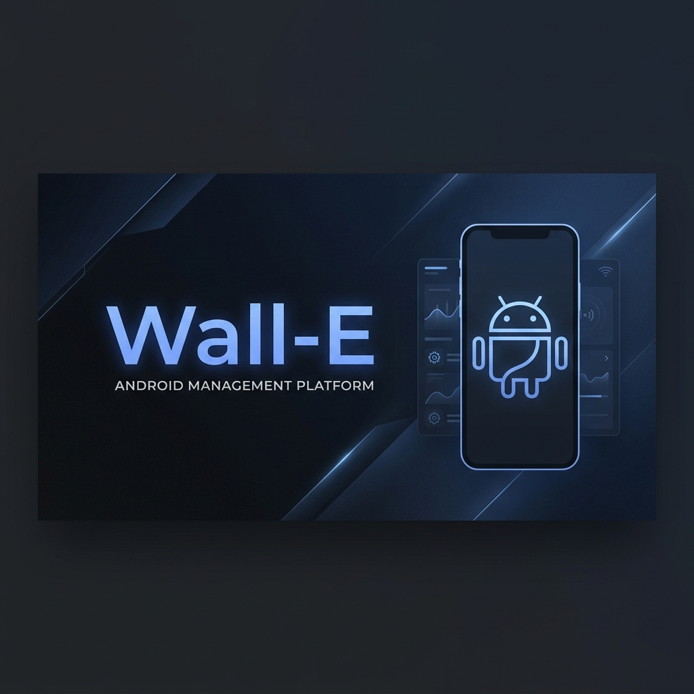
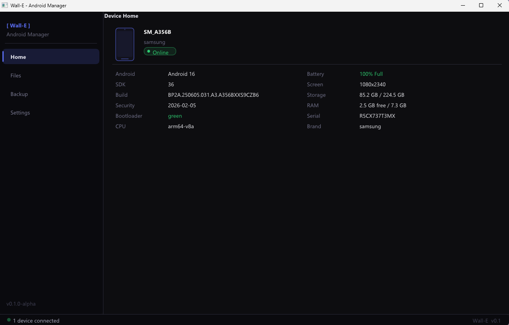
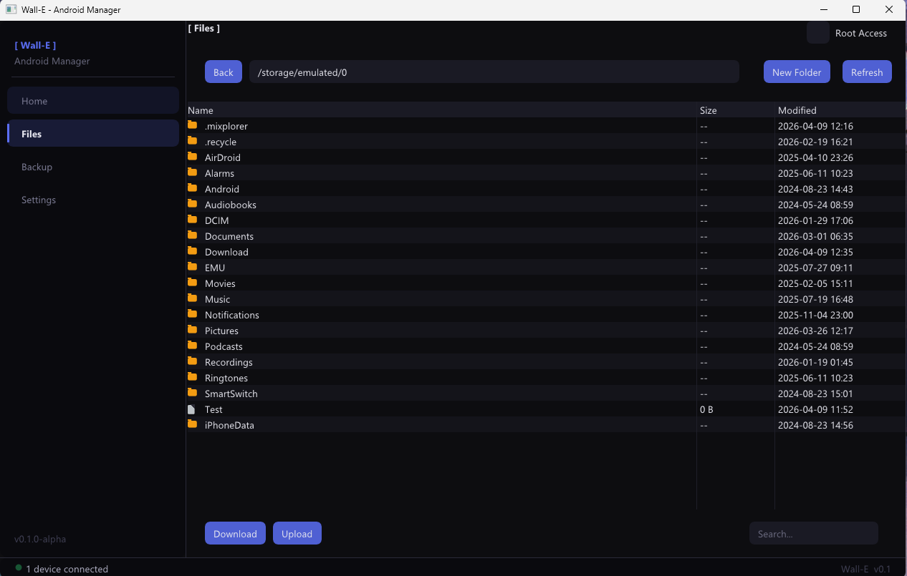

# Wall-E

**Wall-E** is a high-performance Android Device Manager. Built with C++ and ImGui, it provides a native Windows experience for managing your Android devices over a secure, wired connection.

## Features

- **Device Diagnostics**: Real-time monitoring of battery health, storage metrics, RAM usage, and system specifications.
- **Advanced File Manager**: 
  - Full support for Upload, Download (Pull), Rename, and Delete.
  - Interactive breadcrumb navigation and parent-directory hopping.
  - Real-time search filtering for large file lists.
  - Custom vector iconography for a crisp, high-DPI UI.
- **Root Security**: Integrated Root Access toggle with a safety-first warning modal.
- **Conflict Resolution**: Intelligent handling of file collisions (Overwrite, Rename with timestamp, or Skip).

## Getting Started

### Prerequisites
- Windows 10 or 11
- USB Debugging enabled on your Android device

### Zero Setup
Wall-E comes with **Android Platform Tools bundled** in the `platform-tools/` directory. You do not need to install ADB or configure your system PATH.

### Building from Source
1. Clone the repository including submodules.
2. Open `Wall-E.sln` in Visual Studio 2022.
3. Set the configuration to `x64 | Release`.
4. Build and Run.

## Security & Privacy
- **SECURE CONNECTIONS ONLY**: Wall-E strictly enforces wired USB connections. All Wireless/TCP-based ADB devices are ignored to prevent unauthorized remote access.
- **OFFLINE FIRST**: No data leaves your machine; all management is performed locally over ADB.

## Showcase
| Home Dashboard | File Manager |
| :---: | :---: |
|  |  |

## License
Distributed under the MIT License. See `LICENSE` for more information.
